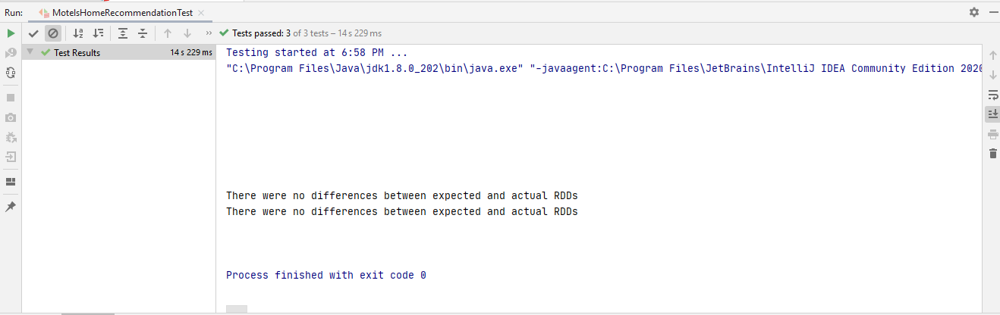

# Spark Core Travel Meta Recommendation
-----------------------

## Spark Core

* Core Abstraction and processing engine
* It provides distributed task dispatching, scheduling, and basic I/O functionalities. 
* Spark uses a specialized fundamental data structure known as RDD (Resilient Distributed Datasets) that is a logical collection of data partitioned across machines.

**Structured API's:** DataSets, DataFrames, SQL  
**Low Level API's:** Distributed Variables, RDD's
 
 
## Test Cases Result:
 
  
 
In the above screenshot, we can see that all 3 test cases have been passed. And there is no difference between actual & expected RDD's. 

**Created by:**  
**Name: Krishna Kumar Singh**  
**Email: krishnaai265@gmail.com**  
**Phone: +91-9368754996** 

